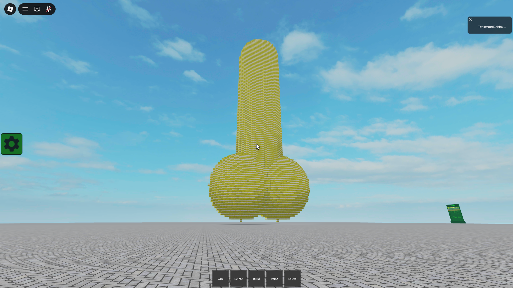
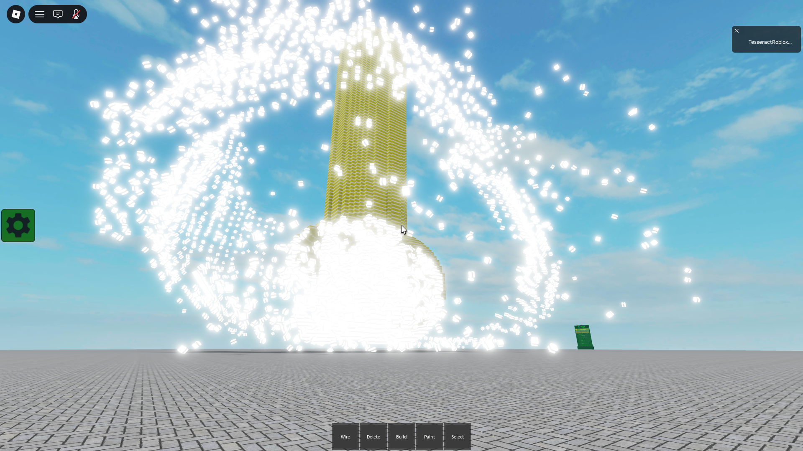

# bl

A C++20 library primarily for encoding and decoding Build Logic savestrings. I
reverse-engineered the format myself without any external help so keep that in
mind.

Python bindings are also available thanks to
[pybind11](https://github.com/pybind/pybind11).

Note that this library is still a WIP. In the future I plan to add more
sophisticated features and also clean up the code a bit more.

## Compilation

bl uses CMake so it should be straightforward to compile bl. On a Linux-based
system:

```sh
git clone https://github.com/I-OCode/bl
cd bl
mkdir build && cd build
cmake -DCMAKE_BUILD_TYPE=Release .. # or use Debug for debug builds
make -j${nproc}
```

To compile the Python bindings, enable the `BL_BUILD_PYTHON_BINDINGS` option.
You can do this by adding `-DBL_BUILD_PYTHON_BINDINGS=ON` to the arguments of
`cmake`.

## Usage

To encode savestrings, first create a `bl::emplacement` object. Then you can use
the `place()` method to place blocks. The `place()` method accepts a `bl::block`
object that contains info for the block. There are `bl::block_name` and
`bl::material` enums for block names and block materials respectively. Finally,
there are the `bl::vec3` and `bl::rotation` classes, where `vec3` can store a 3D
position within the Build Logic world or a color and `rotation` stores rotations
of blocks.

```cpp
#include <bl.hpp>

int main() {
    bl::emplacement empl;

    bl::block blk = {
        .value = "foobar", // Value of the block.
        .name = bl::block_name::eBlock, // Name of the block.
        .mat = bl::material::eDefault, // Material of the block.
        .pos = bl::vec3(127, 0, 127), // Position of the block.
        .color = bl::vec3(255, 255, 255), // Color of the block.
        .rot = bl::rotation(), // Rotation of the block.
        .activated = false // Whether the block is activated or not (this
                           // applies to things like levers).
    };

    // Place the block.
    empl.place(blk);
}
```

Then you can encode the emplacement.

```cpp
std::string s = empl.save(); // The `save()` method returns a savestring.
```

The `place()` method also returns an ID that you can then pass into the
`remove()` method to remove the block, or you can pass it into `connect()` to
create wire connections.

```cpp
auto id = empl.place(blk);
empl.remove(id);

// Or you can make wire connections.

auto id1 = empl.place(some_example_block1);
auto id2 = empl.place(some_example_block2);

bl::block_wire wire = {
    .from_blk = id1, // Source block.
    .to_blk = id2, // Destination block.
    .from_con = '69420', // Source connector.
    .to_con = '373737' // Destination connector.
};

empl.connect(wire);
```

`connect()` itself returns an ID that can be passed to the `disconnect()`
method, which removes wires. You can use the `clear()` method to clear all
blocks and wires. You can also directly access the `blks` and `wires` members of
emplacements.

There are human-readable constants for connectors. These are stored in the
`bl::con` namespace. For example, these are the connectors for the AND gate:

```cpp
bl::con::eAND_Gate::a // First input.
bl::con::eAND_Gate::b // Second input.
bl::con::eAND_Gate::q // Output.
```

You can load emplacements from savestrings by using the constructor of
`bl::emplacement`.

```cpp
bl::emplacement empl{"G$Bwf"};

// `empl` should now contain a block at pos (127, 0, 127).

// This also works (but this is a pretty inefficient way to copy emplacements).
bl::emplacement empl2{empl.save()};

// Better just to copy emplacements directly.
bl::emplacement empl2b{empl};
```

## But what about Python?

Once you have built the Python bindings, you'll find something like `pybl.so` or
`pybl.cpython-[...].so` in the `build` directory. You can then fire up your
Python interpreter in the directory containing the `.so` file (this can be
`build` or somewhere else if you moved it) and then simply run `import pybl` to
import bl.

There's probably a way to actually properly install the Python bindings on your
system but I can't be bothered to find out how. Just stick the `.so` file
wherever you need bl.

Anyways, using the Python bindings themselves is simple:

```python
# Direct Python equivalent of the code samples in the Usage section.

import pybl

empl = pybl.emplacement()

blk = pybl.block(
    value="foobar", # Value of the block.
    name=pybl.block_name.eBlock, # Name of the block.
    mat=pybl.material.eDefault, # Material of the block.
    pos=pybl.vec3(127, 0, 127), # Position of the block.
    color=pybl.vec3(255, 255, 255), # Color of the block.
    rot=pybl.rotation(), # Rotation of the block.
    activated=False # Whether the block is activated or not (this applies to
                    # things like levers).
)

# Place the block.
empl.place(blk)

s = empl.save() # The `save()` method returns a savestring.

id = empl.place(blk)
empl.remove(id)

# Or you can make wire connections.

id1 = empl.place(some_example_block1)
id2 = empl.place(some_example_block2)

wire = pybl.block_wire(
    from_blk=id1, # Source block.
    to_blk=id2, # Destination block.
    from_con="69420", # Source connector.
    to_con="373737" # Destination connector.
)

empl.connect(wire)

pybl.con.eAND_Gate.a # First input.
pybl.con.eAND_Gate.b # Second input.
pybl.con.eAND_Gate.q # Output.

# `empl` should now contain a block at pos (127, 0, 127).
empl = pybl.emplacement("G$Bwf")

# This also works (but this is a pretty inefficient way to copy emplacements).
empl2 = pybl.emplacement(empl.save())

# Better just to copy emplacements directly.
empl2b = pybl.emplacement(empl)
```

## How does the savestring format work?

See the `DOCS.md` file. You'll find all your information in there.

## Demos/Examples

Build Logic's first 100-block tall nuclear pp:



The same pp except now it's exploding:



## Time to do some trolling

I reverse-engineered the keypad encoding format too. And bl is open-source. So
you can crack any keypad in Build Logic for free :D

```cpp
#include <print>
#include <bl.hpp>

int main() {
    // Step 1. In the game, press the "L" key or run the command "/m debug" to
    //         open the debug menu.
    // Step 2. Hover your mouse over the keypad you want to crack.
    // Step 3. Look for "Value" and type out the text to the right of it into
    //         the `val` variable in the code here.
    // Step 4. Run the program, and voila! The keypad code digits get printed
    //         out and you are now officially a criminal.
    std::string val = "<keypad value goes here>";
    std::println("{}", bl::keypad_cfg(val).code_digits);
}
```

If you're in a hurry, you can also do this with Python:

```python
>>> import pybl
>>> pybl.keypad_cfg("<keypad value goes here>").code_digits
```

Hopefully Tomtom doesn't make a new super-duper keypad with
cryptographically-secure encryption to stop people like me. Tomtom, if you're
reading this, you won't do that. Right?

## Contributing

To contribute you could just open an issue, or you could open pull requests. To
do this, make a fork of bl, put your changes in there, and make a pull request
to bl from your fork.

Important: You should follow the
[coding style](https://github.com/I-OCode/c-cpp-coding-style) when contributing
code.

## License

bl is licensed under the MIT license. See `LICENSE.txt` for the details.
